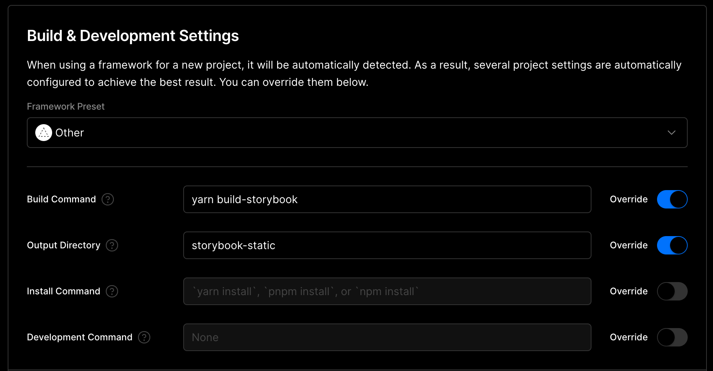

# mantine-component-catalog

作成日：2022/11/15
更新日：2022/11/19

### Webアプリにてよくあるコンポーネントをmantineで作ったやつ
※一部素のreact使ったコンポーネントも入っちゃってます

- [デモページ](https://mantine-component-catalog.vercel.app/) ※使用するにはメールアドレス認証が必要になります
- [storybook](https://storybook-for-mantine-component-catalog-pfzo.vercel.app/)

### コンポーネントの設計・命名（今までやったことないけど以下のようにやってみる）
- Atomic Design は一旦使用しない（基本はUIコンポーネントを使用するのでそれを勘案してコンポーネントを配置するのはしんどい）
  - UIコンポーネントを使用すればオリジナルのコンポーネントの数は抑えられるハズなので一旦/componentとか/pageUniqueとかだけにしてみる
- 1コンポーネントにつき下記３ファイルを作成
  - コンポーネント名.tsx
  - コンポーネント名.stories.tsx
  - コンポーネント名.mdx
- コンポーネント名でディレクトリ切ってindex.tsxにしようと考えたが、全てのファイルがindex.tsxになってファイル名で何かしたいとき（何それ）に困りそうだなぁと思いやめた。

### storybookのデプロイ
- 開発者以外も見られるようにしたい要望を想定し、vercelへデプロイしている
- vercelの設定
  - Framework Preset: `Other`
  - Build Command: `yarn build-storybook`
  - Output Directory: `storybook-static`
  